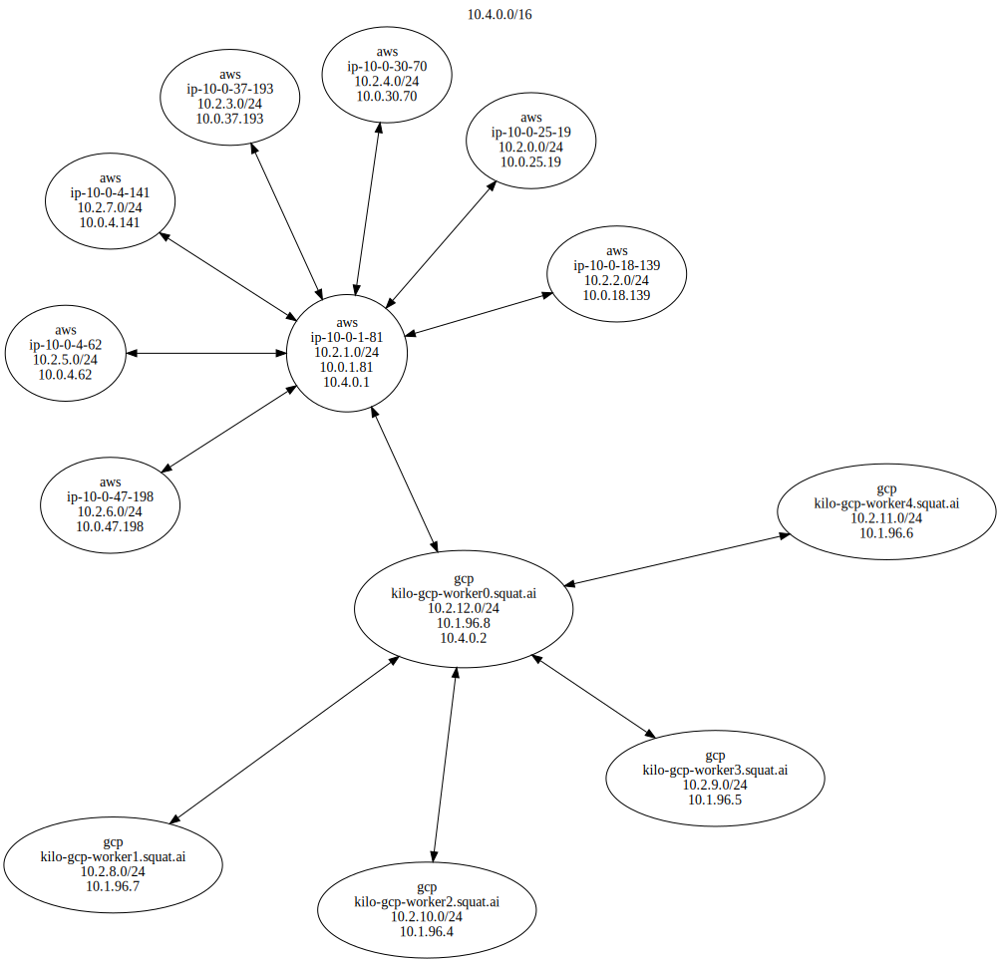

<p align="center"></p>

# Kilo

Kilo is a multi-cloud network overlay built on WireGuard and designed for Kubernetes.

[](https://travis-ci.org/squat/kilo)
[](https://goreportcard.com/report/github.com/squat/kilo)

## Overview

Kilo connects nodes in a cluster by providing an encrypted layer 3 network that can span across data centers and public clouds.
By allowing pools of nodes in different locations to communicate securely, Kilo enables the operation of multi-cloud clusters.

## How it works

Kilo uses [WireGuard](https://www.wireguard.com/), a performant and secure VPN, to create a mesh between the different logical locations in a cluster.
The Kilo agent, `kg`, runs on every node in the cluster, setting up the public and private keys for the VPN as well as the necessary rules to route packets between locations.

Kilo can operate as an add-on complimenting the cluster-networking solution currently installed on a cluster.
This means that if a cluster uses, for example, Calico for networking, Kilo can be installed on top to enable pools of nodes in different locations to join; Kilo will take care of the network between locations, while Calico will take care of the network within locations.

## Installing on Kubernetes

Kilo can be installed on any Kubernetes cluster either pre- or post-bring-up.

### Step 1: install WireGuard

Kilo requires the WireGuard kernel module on all nodes in the cluster.
For most Linux distributions, this can be installed using the system package manager.
For Container Linux, WireGuard can be easily installed using a DaemonSet:

```shell
kubectl apply -f https://raw.githubusercontent.com/squat/modulus/master/wireguard/daemonset.yaml
```

### Step 2: open WireGuard port

The nodes in the mesh will require an open UDP port in order to communicate.
By default, Kilo uses UDP port 51820.

### Step 3: specify locations

Kilo needs to know which nodes are in each location.
If the cluster does not automatically set the [failure-domain.beta.kubernetes.io/region](https://kubernetes.io/docs/reference/kubernetes-api/labels-annotations-taints/#failure-domain-beta-kubernetes-io-region) node label, then the [kilo.squat.ai/location](./docs/annotations.md#location) annotation can be used.
For example, the following snippet could be used to annotate all nodes with `GCP` in the name:

```shell
for node in $(kubectl get nodes | grep -i gcp | awk '{print $1}'); do kubectl annotate node $node kilo.squat.ai/location="gcp"; done
```

### Step 4: ensure nodes have public IP

At least one node in each location must have a public IP address.
If the public IP address is not automatically configured on the node's Ethernet device, it can be manually specified using the [kilo.squat.ai/force-external-ip](./docs/annotations.md#force-external-ip) annotation.

### Step 5: install Kilo!

Kilo can be installed by deploying a DaemonSet to the cluster.

To run Kilo on kubeadm:

```shell
kubectl apply -f https://raw.githubusercontent.com/squat/kilo/master/manifests/kilo-kubeadm.yaml
```

To run Kilo on bootkube:

```shell
kubectl apply -f https://raw.githubusercontent.com/squat/kilo/master/manifests/kilo-bootkube.yaml
```

To run Kilo on Typhoon:

```shell
kubectl apply -f https://raw.githubusercontent.com/squat/kilo/master/manifests/kilo-typhoon.yaml
```

## Analysis

The topology of a Kilo network can be analyzed using the `kgctl` binary.
For example, the `graph` command can be used to generate a graph of the network in Graphviz format:

```shell
kgctl graph --kubeconfig=$KUBECONFIG | twopi -Tsvg > cluster.svg
```


