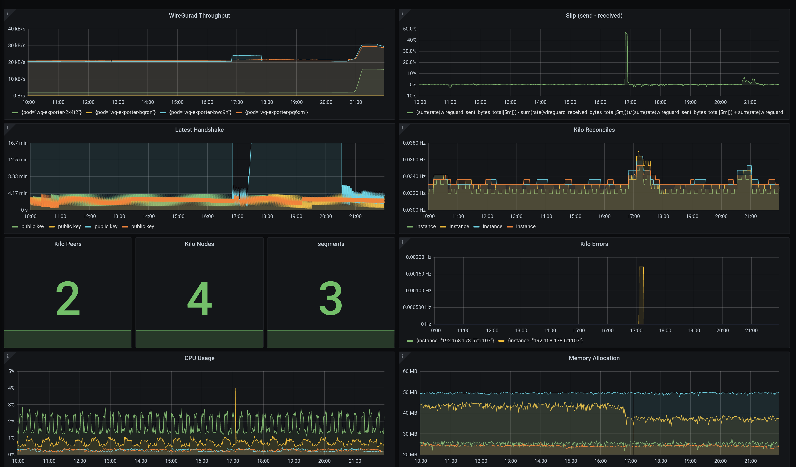

# Monitoring

The following assumes that you have applied the [kube-prometheus](https://github.com/prometheus-operator/kube-prometheus) monitoring stack onto your cluster.

## Kilo

Monitor the Kilo DaemonSet with:
```shell
kubectl apply -f https://raw.githubusercontent.com/squat/kilo/main/manifests/podmonitor.yaml
```

## WireGuard

Monitor the WireGuard interfaces with:
```shell
kubectl create ns kilo
kubectl apply -f https://raw.githubusercontent.com/squat/kilo/main/manifests/wg-exporter.yaml
```

The manifest will deploy the [Prometheus WireGuard Exporter](https://github.com/MindFlavor/prometheus_wireguard_exporter) as a DaemonSet and a [PodMonitor](https://docs.openshift.com/container-platform/4.8/rest_api/monitoring_apis/podmonitor-monitoring-coreos-com-v1.html).

By default the kube-prometheus stack only monitors the `default`, `kube-system` and `monitoring` namespaces.
In order to allow Prometheus to monitor the `kilo` namespace, apply the Role and RoleBinding with:
```shell
kubectl apply -f https://raw.githubusercontent.com/squat/kilo/main/manifests/wg-exporter-role-kube-prometheus.yaml
```

## Metrics

### Kilo

Kilo exports some standard metrics with the Prometheus GoCollector and ProcessCollector.
It also exposes some Kilo-specific metrics.

```
# HELP kilo_errors_total Number of errors that occurred while administering the mesh.
# TYPE kilo_errors_total counter

# HELP kilo_leader Leadership status of the node.
# TYPE kilo_leader gauge

# HELP kilo_nodes Number of nodes in the mesh.
# TYPE kilo_nodes gauge

# HELP kilo_peers Number of peers in the mesh.
# TYPE kilo_peers gauge

# HELP kilo_reconciles_total Number of reconciliation attempts.
# TYPE kilo_reconciles_total counter
```

### WireGuard

The [Prometheus WireGuard Exporter](https://github.com/MindFlavor/prometheus_wireguard_exporter) exports the following metrics:

```
# HELP wireguard_sent_bytes_total Bytes sent to the peer
# TYPE wireguard_sent_bytes_total counter

# HELP wireguard_received_bytes_total Bytes received from the peer
# TYPE wireguard_received_bytes_total counter

# HELP wireguard_latest_handshake_seconds Seconds from the last handshake
# TYPE wireguard_latest_handshake_seconds gauge
```

## Display some Metrics

If your laptop is a Kilo peer of the cluster you can access the Prometheus UI by navigating your browser directly to the cluster IP of the `prometheus-k8s` service.
Otherwise use `port-forward`:
```shell
kubectl -n monitoring port-forward svc/prometheus-k8s 9090
```
and navigate your browser to `localhost:9090`.
Check if you can see the PodMonitors for Kilo and the WireGuard Exporter under **Status** -> **Targets** in the Prometheus web UI.

If you don't see them, check the logs of the `prometheus-k8s` Pods; it may be that Prometheus doesn't have the permission to get Pods in the `kilo` namespace.
In this case, you need to apply the Role and RoleBinding from above.

Navigate to **Graph** and try to execute a simple query, e.g. type `kilo_nodes` and click on `execute`.
You should see some data.

## Using Grafana

Let's navigate to the Grafana dashboard.
Again, if your laptop is not a Kilo peer, use `port-forward`:
```shell
kubectl -n monitoring port-forward svc/grafana 3000
```

Now navigate your browser to `localhost:3000`.
The default user and password is `admin` `admin`.

An example configuration for a dashboard displaying Kilo metrics can be found [here](https://raw.githubusercontent.com/squat/kilo/main/docs/grafana/kilo.json).
You can import this dashboard by hitting **+** -> **Import** on the Grafana dashboard.

The dashboard looks like this:



